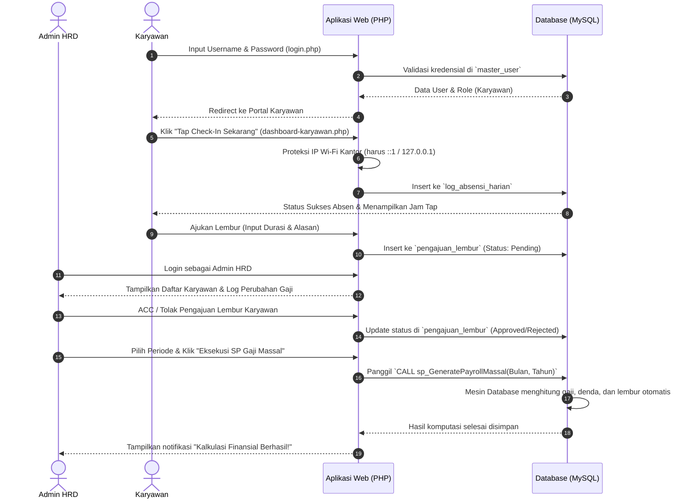
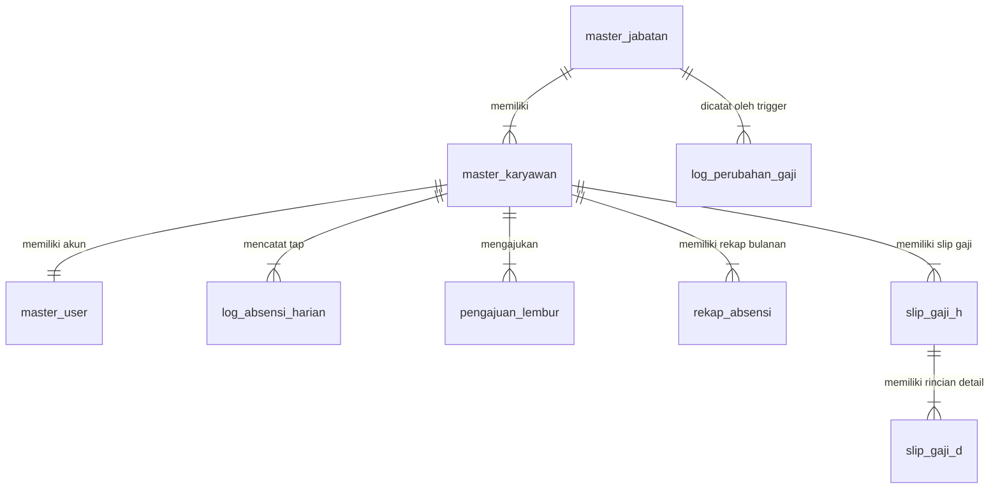
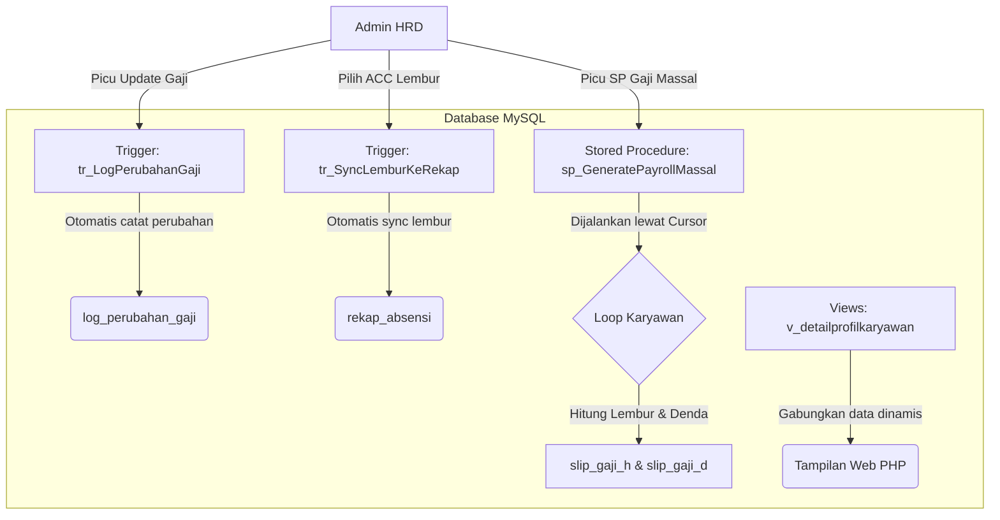

# Panduan Alur Aplikasi & Database Payroll App Enterprise

Dokumen ini menjelaskan bagaimana aplikasi penggajian ini bekerja, baik dari sisi **Antarmuka Pengguna (Web App)** maupun dari sisi **Mesin Database (MySQL)**. 

Aplikasi ini menggunakan pendekatan **Database-Centric**, di mana kalkulasi finansial berat (gaji, denda, lembur) dikerjakan langsung oleh server database MySQL melalui *Stored Procedure*, *Cursor*, *Trigger*, dan *View*, bukan oleh kode PHP.

---

## ⚙️ 0. Wizard Instalasi Awal (Web Installer)

Sebelum masuk ke sistem utama, aplikasi menyediakan **Setup Wizard** interaktif yang terletak di berkas `install.php` untuk mempermudah pemasangan aplikasi di localhost:
1. **Pemeriksaan Database:** File `index.php` akan memeriksa keberadaan berkas koneksi database `config/database.php`. Jika berkas tersebut belum dibuat, sistem otomatis mengalihkan pengguna ke halaman `install.php`.
2. **Setup Kredensial & Schema:** Pengguna memasukkan kredensial database (host, user, pass, nama db) di halaman Wizard. Installer akan:
   * Membuat database secara otomatis.
   * Menulis berkas konfigurasi database ke `config/database.php`.
   * Melakukan import skema database, tabel, stored procedure, trigger, dan view dari berkas `db_payroll (1).sql`.
3. **Penyuntikan Data (Seeder):** Setelah database terbuat dan terkonfigurasi, pengguna diarahkan ke tombol **"Jalankan Seeder & Selesaikan Setup"** yang memicu `data_dummy.php` untuk memasukkan 50 akun karyawan demo dan 1 akun Admin HRD secara otomatis.
4. **Masuk Aplikasi:** Setelah seeder selesai, pengguna dapat langsung mengklik tombol masuk untuk menuju halaman login utama.

---

## 1. Alur Aplikasi (Application Workflow)

Berikut adalah diagram alur bagaimana pengguna (Admin HRD & Karyawan) berinteraksi dengan aplikasi ini:

<picture>
  <source media="(prefers-color-scheme: dark)" srcset="public/images/workflow_seq_dark.png">
  
</picture>



### Detail Alur Berdasarkan Role

#### A. Alur Halaman Karyawan (ESS Portal)
1. **Login:** Karyawan masuk menggunakan akun mereka (contoh: `budi`).
2. **Dashboard Karyawan:** Menampilkan ringkasan profil, status kehadiran hari ini, akumulasi kinerja bulan berjalan, dan slip gaji terakhir.
3. **Absen Harian:** Karyawan melakukan *Tap Check-In*. Sistem akan memvalidasi IP koneksi. Jika cocok dengan IP Wi-Fi kantor, data masuk ke log harian.
4. **Pengajuan Lembur:** Karyawan mengisi form lembur. Data ini tersimpan dengan status *Pending* menunggu persetujuan HRD.
5. **Melihat Slip Gaji:** Karyawan melihat detail pendapatannya bulan lalu secara transparan.

#### B. Alur Halaman Admin HRD (Control Center)
1. **Login:** Admin masuk menggunakan akun HR (contoh: `admin_hrd`).
2. **Dashboard HRD:** Menampilkan rekapitulasi seluruh karyawan secara *real-time*.
3. **Persetujuan Lembur:** Admin melihat daftar permohonan lembur dari karyawan, lalu memilih untuk menyetujui (**ACC**) atau menolak (**Tolak**).
4. **Update Gaji Master:** Admin bisa memperbarui gaji pokok per jabatan. Perubahan ini secara otomatis memicu pencatatan log audit di database.
5. **Kalkulasi Gaji Massal:** Di akhir bulan, Admin memilih periode (Bulan & Tahun) lalu menekan tombol eksekusi untuk menghitung gaji seluruh karyawan sekaligus.

---

## 2. Alur Database (Database Workflow)

Database `db_payroll` dirancang untuk mengotomatiskan seluruh perhitungan rumit secara internal. Berikut adalah skema hubungan antar tabel (ERD):

<picture>
  <source media="(prefers-color-scheme: dark)" srcset="public/images/database_erd_dark.png">
  
</picture>



### Fungsi Utama Tiap Tabel

*   **`master_jabatan`**: Menyimpan data gaji pokok dasar dan tunjangan untuk tiap jabatan.
*   **`master_karyawan`**: Menyimpan data profil karyawan yang aktif bekerja.
*   **`master_user`**: Menyimpan kredensial login dan hak akses (*role*) karyawan/admin.
*   **`log_absensi_harian`**: Mencatat log aktivitas tap check-in harian (tanggal, jam masuk, jam pulang, IP address).
*   **`pengajuan_lembur`**: Menyimpan data pengajuan jam lembur karyawan beserta status persetujuan dari HRD.
*   **`rekap_absensi`**: Berisi rangkuman kinerja bulanan karyawan (total hari hadir, total alpa, total menit terlambat, total jam lembur) yang menjadi dasar utama perhitungan gaji.
*   **`slip_gaji_h` (Header)**: Menyimpan total akhir keuangan karyawan per bulan (total gaji kotor, total denda potongan, dan gaji bersih akhir).
*   **`slip_gaji_d` (Detail)**: Menyimpan rincian komponen keuangan (berapa denda alpa, berapa denda terlambat, berapa upah lembur, dll.) untuk transparansi slip gaji.
*   **`log_perubahan_gaji`**: Menyimpan riwayat audit perubahan gaji pokok jabatan secara otomatis.

---

### 2.1 Detail Mekanisme Database Saat Aksi Frontend Dieksekusi

Bagian ini menjelaskan apa yang terjadi di tingkat database (tabel, kolom, dan query SQL) saat pengguna memicu tindakan di antarmuka web:

#### A. Saat Karyawan Mengajukan Lembur Kerja
1. **Frontend:** Karyawan mengisi form durasi (misal: `3` jam) dan alasan lembur (misal: `Mengejar rilis fitur payroll`), lalu klik tombol kirim.
2. **Proses Database:**
   * Backend PHP menerima input lalu menjalankan query SQL `INSERT` ke tabel `pengajuan_lembur` dengan status awal `Pending`:
     ```sql
     INSERT INTO pengajuan_lembur (id_karyawan, tanggal_lembur, durasi_jam, keterangan, status_approval) 
     VALUES (2, '2026-06-10', 3, 'Mengejar rilis fitur payroll', 'Pending');
     ```
   * **Hasil:** Baris data baru bertambah di tabel `pengajuan_lembur` dengan status default `Pending`. Pada tahap ini, total jam lembur di `rekap_absensi` karyawan belum bertambah.

#### B. Saat Admin HRD Menyetujui (ACC) atau Menolak Pengajuan Lembur
1. **Frontend:** HRD membuka dashboard approval lembur, lalu mengklik tombol **"ACC"** atau **"Tolak"**.
2. **Proses Database:**
   * PHP memproses request tersebut dengan menjalankan query SQL `UPDATE` status pengajuan lembur:
     ```sql
     UPDATE pengajuan_lembur 
     SET status_approval = 'Approved' -- atau 'Rejected'
     WHERE id_lembur = 15;
     ```
   * **Hasil:** Kolom `status_approval` pada tabel `pengajuan_lembur` berubah menjadi `Approved` atau `Rejected`.
   * **Pemicu Trigger:** Secara otomatis, engine database menyalakan trigger `tr_SyncLemburKeRekap` setelah data di-update. Jika status berubah menjadi `'Approved'`, trigger secara otomatis menambahkan durasi jam lembur tersebut ke kolom `total_jam_lembur` di tabel `rekap_absensi` secara real-time. Hal ini membuat total jam lembur di dashboard karyawan langsung bertambah seketika setelah di-ACC oleh HRD!

#### C. Saat Karyawan Melakukan Check-In Absensi (Tap Masuk)
1. **Frontend:** Karyawan mengklik tombol **"Tap Check-In Sekarang"** di portal.
2. **Proses Database:**
   * Sistem memvalidasi kesesuaian IP Wi-Fi kantor. Jika cocok, PHP akan menjalankan query SQL `INSERT` kehadiran:
     ```sql
     INSERT INTO log_absensi_harian (id_karyawan, tanggal, jam_masuk, status_kehadiran, ip_address, waktu_server_masuk) 
     VALUES (2, '2026-06-10', '08:00:23', 'Hadir', '127.0.0.1', NOW());
     ```
   * **Hasil:** Kehadiran hari ini tercatat di tabel `log_absensi_harian`.

#### D. Saat Admin HRD Mengubah Gaji Pokok Master Jabatan
1. **Frontend:** HRD memperbarui nominal gaji pokok suatu jabatan di master data, lalu klik simpan.
2. **Proses Database:**
   * PHP mengirimkan query SQL `UPDATE` ke tabel master jabatan:
     ```sql
     UPDATE master_jabatan 
     SET gaji_pokok = 12000000 
     WHERE id_jabatan = 1;
     ```
   * **Otomasi Trigger:** MySQL secara otomatis memicu Trigger `tr_LogPerubahanGaji` untuk mencatat log audit:
     ```sql
     INSERT INTO log_perubahan_gaji (id_jabatan, nama_jabatan, gaji_lama, gaji_baru, diubah_oleh, tanggal_perubahan) 
     VALUES (1, 'Manager', 10000000, 12000000, CURRENT_USER(), NOW());
     ```
   * **Hasil:** Gaji pokok diperbarui dan detail audit tersimpan di tabel log perubahan gaji.

#### E. Saat Admin HRD Mengeksekusi SP Gaji Massal (Kalkulasi Gaji Bulanan)
1. **Frontend:** HRD memilih bulan dan tahun periode gaji, lalu menekan tombol **"Eksekusi SP Gaji Massal"**.
2. **Proses Database:**
   * PHP memanggil Stored Procedure di MySQL:
     ```sql
     CALL sp_GeneratePayrollMassal(6, 2026);
     ```
   * **Mekanisme Internal Stored Procedure:**
     * Menghapus slip gaji periode terkait di tabel `slip_gaji_d` (detail) dan `slip_gaji_h` (header) agar tidak ada duplikasi data.
     * Menggunakan **Cursor** untuk mengambil summary absensi per karyawan dari tabel `rekap_absensi`.
     * Menghitung total lembur (`Total Jam Lembur * Rp 50.000`), denda alpa (`Total Alpa * Rp 150.000`), denda terlambat (`FLOOR(Total Menit Terlambat / 10) * Rp 10.000`).
     * Memasukkan hasil akhir ke tabel `slip_gaji_h` (Header) dan rincian komponen ke `slip_gaji_d` (Detail).

---

## 3. Cara Kerja 4 Fitur Database Utama

Aplikasi ini sangat unik karena memindahkan logika pemrograman dari file PHP ke dalam database menggunakan 4 fitur canggih MySQL:

<picture>
  <source media="(prefers-color-scheme: dark)" srcset="public/images/architecture_flow_dark.png">
  
</picture>



### A. Stored Procedure & Cursor (Kalkulator Gaji Massal)
Saat Admin HRD menekan tombol "Eksekusi SP Gaji Massal" untuk periode tertentu (misal: Juni 2026):
1. PHP memanggil `CALL sp_GeneratePayrollMassal(6, 2026)`.
2. MySQL membuka sebuah **Cursor** (`cursor_karyawan`) untuk mengambil daftar seluruh karyawan aktif beserta rangkuman absensi mereka di bulan Juni dari tabel `rekap_absensi`.
3. MySQL melakukan perulangan (**Looping**) untuk memproses data satu per satu karyawan:
    *   **Menghitung Upah Lembur:** `Total Jam Lembur * Tarif Lembur per Jam` (diambil dari parameter konfigurasi).
    *   **Menghitung Potongan Alpa:** `Total Alpa * Denda Alpa per Hari`.
    *   **Menghitung Potongan Terlambat:** Dihitung kelipatan 10 menit menggunakan rumus `FLOOR(Total Menit Terlambat / 10) * Tarif Denda Terlambat`.
    *   **Menyimpan Slip Gaji:** Menyimpan total gaji bersih ke `slip_gaji_h` (Header) dan rincian transaksi pendukungnya ke `slip_gaji_d` (Detail).

### B. Trigger (Otomasi Log Audit & Sinkronisasi Real-Time)
Aplikasi ini memiliki 2 trigger penting di database:
1. **`tr_LogPerubahanGaji` (Keamanan Audit):** 
   Ketika Admin mengubah nominal gaji di tabel `master_jabatan`, trigger ini secara instan mencatat nominal gaji lama, gaji baru, username pelaku, dan waktu perubahan ke tabel `log_perubahan_gaji` untuk menjamin transparansi data audit.
2. **`tr_SyncLemburKeRekap` (Sinkronisasi Lembur):**
   Ketika HRD mengubah status lembur menjadi `'Approved'` di tabel `pengajuan_lembur`, trigger ini secara otomatis meng-update kolom `total_jam_lembur` di tabel `rekap_absensi` secara real-time. Hal ini membuat total jam lembur di dashboard karyawan langsung bertambah seketika setelah disetujui.

### C. View (Penyederhana Tampilan PHP)
Untuk menampilkan halaman dashboard yang lengkap, PHP membutuhkan data gabungan yang rumit (profil karyawan, detail jabatan, rekap absensi, denda, dan slip gaji terakhir).
1. Alih-alih menulis query `JOIN` yang sangat panjang di file PHP, database menyediakannya dalam bentuk virtual bernama **View** (`v_detailprofilkaryawan`).
2. Kode PHP cukup memanggil query sederhana: `SELECT * FROM v_DetailProfilKaryawan`.
3. MySQL akan menggabungkan seluruh data tersebut di belakang layar dan mengirimkan hasilnya yang sudah rapi ke halaman web PHP.

---

## 🔑 4. Kredensial Akun Pengujian (Testing Accounts)

Untuk mempermudah pengujian alur kerja sistem di localhost, berikut adalah daftar akun demo yang telah terdaftar di database:

| Peran (Role) | Username | Password | Nama Lengkap Karyawan |
| :--- | :--- | :--- | :--- |
| **Admin HRD** | `admin_hrd` | `hrd_123` | *Admin Utama HRD* |
| **Karyawan 1** | `alghifari` | `karyawan_123` | Alghifari Amar |
| **Karyawan 2** | `budi` | `karyawan_123` | Budi Santoso |
| **Karyawan 3** | `karyawan3` | `karyawan_123` | Siti Aminah |
| **Karyawan 4** | `karyawan4` | `karyawan_123` | Puput Wulandari |
| **Karyawan 5** | `karyawan5` | `karyawan_123` | Agus Hermawan |
| **Karyawan 6** | `karyawan6` | `karyawan_123` | Hendra Wijaya |
| **Karyawan 7** | `karyawan7` | `karyawan_123` | Dewi Lestari |
| **Karyawan 8** | `karyawan8` | `karyawan_123` | Ahmad Fauzi |
| **Karyawan 9** | `karyawan9` | `karyawan_123` | Eko Prasetyo |
| **Karyawan 10** | `karyawan10` | `karyawan_123` | Rina Fitriani |
| **Karyawan 11** | `karyawan11` | `karyawan_123` | Adi Nugroho |
| **Karyawan 12** | `karyawan12` | `karyawan_123` | Bambang Susilo |
| **Karyawan 13** | `karyawan13` | `karyawan_123` | Joko Widodo |
| **Karyawan 14** | `karyawan14` | `karyawan_123` | Megawati Sukarno |
| **Karyawan 15** | `karyawan15` | `karyawan_123` | Prabowo Subianto |
| **Karyawan 16** | `karyawan16` | `karyawan_123` | Gibran Rakabuming |
| **Karyawan 17** | `karyawan17` | `karyawan_123` | Anies Baswedan |
| **Karyawan 18** | `karyawan18` | `karyawan_123` | Ganjar Pranowo |
| **Karyawan 19** | `karyawan19` | `karyawan_123` | Ridwan Kamil |
| **Karyawan 20** | `karyawan20` | `karyawan_123` | Sandiaga Uno |
| **Karyawan 21** | `karyawan21` | `karyawan_123` | Erick Thohir |
| **Karyawan 22** | `karyawan22` | `karyawan_123` | Luhut Pandjaitan |
| **Karyawan 23** | `karyawan23` | `karyawan_123` | Sri Mulyani |
| **Karyawan 24** | `karyawan24` | `karyawan_123` | Retno Marsudi |
| **Karyawan 25** | `karyawan25` | `karyawan_123` | Basuki Hadimuljono |
| **Karyawan 26** | `karyawan26` | `karyawan_123` | Mahfud MD |
| **Karyawan 27** | `karyawan27` | `karyawan_123` | Najwa Shihab |
| **Karyawan 28** | `karyawan28` | `karyawan_123` | Raffi Ahmad |
| **Karyawan 29** | `karyawan29` | `karyawan_123` | Nagita Slavina |
| **Karyawan 30** | `karyawan30` | `karyawan_123` | Deddy Corbuzier |
| **Karyawan 31** | `karyawan31` | `karyawan_123` | Baim Wong |
| **Karyawan 32** | `karyawan32` | `karyawan_123` | Paula Verhoeven |
| **Karyawan 33** | `karyawan33` | `karyawan_123` | Atta Halilintar |
| **Karyawan 34** | `karyawan34` | `karyawan_123` | Aurel Hermansyah |
| **Karyawan 35** | `karyawan35` | `karyawan_123` | Raditya Dika |
| **Karyawan 36** | `karyawan36` | `karyawan_123` | Ernest Prakasa |
| **Karyawan 37** | `karyawan37` | `karyawan_123` | Sule Sutisna |
| **Karyawan 38** | `karyawan38` | `karyawan_123` | Andre Taulany |
| **Karyawan 39** | `karyawan39` | `karyawan_123` | Vincent Rompies |
| **Karyawan 40** | `karyawan40` | `karyawan_123` | Desta Mahendra |
| **Karyawan 41** | `karyawan41` | `karyawan_123` | Tora Sudiro |
| **Karyawan 42** | `karyawan42` | `karyawan_123` | Indro Warkop |
| **Karyawan 43** | `karyawan43` | `karyawan_123` | Dono Prasetyo |
| **Karyawan 44** | `karyawan44` | `karyawan_123` | Kasino Wibowo |
| **Karyawan 45** | `karyawan45` | `karyawan_123` | Indrojoyo Kusumo |
| **Karyawan 46** | `karyawan46` | `karyawan_123` | Dian Sastrowardoyo |
| **Karyawan 47** | `karyawan47` | `karyawan_123` | Nicholas Saputra |
| **Karyawan 48** | `karyawan48` | `karyawan_123` | Reza Rahadian |
| **Karyawan 49** | `karyawan49` | `karyawan_123` | Chelsea Islan |
| **Karyawan 50** | `karyawan50` | `karyawan_123` | Pevita Pearce |
