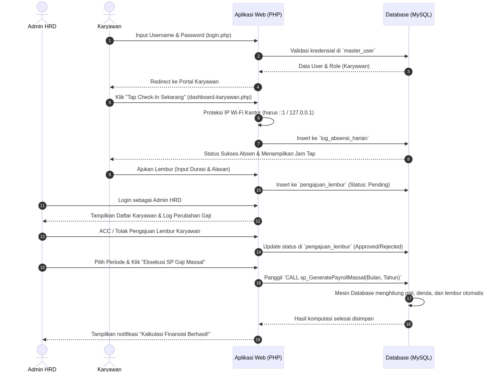
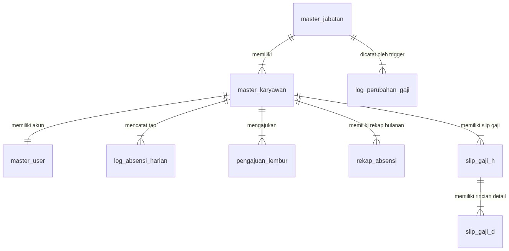
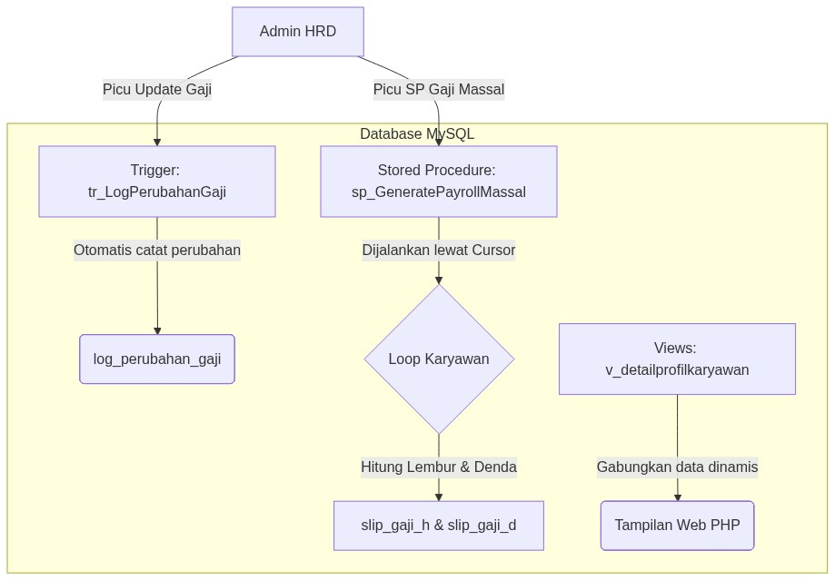

# Laporan Perbaikan Sistem Payroll PHP (Changelog)

Dokumen ini berisi daftar seluruh perbaikan, modifikasi, dan penambahan fitur yang telah dilakukan pada project Payroll PHP agar dapat berjalan dengan stabil di environment XAMPP (MariaDB & Apache).

---

## 📂 Ringkasan Perubahan Berkas (File Changes Summary)

Berikut adalah rangkuman berkas baru yang ditambahkan dan berkas lama yang dimodifikasi dalam perbaikan ini:

### 1. Berkas Baru yang Ditambahkan:
*   📄 **`index.php`** (Terletak di root project)
    *   *Deskripsi:* Mengalihkan secara otomatis (*auto-redirect*) ke halaman `login.php` saat mengakses root URL aplikasi di localhost (jika file konfigurasi database sudah ada).
*   📄 **`data_dummy.php`** (Terletak di root project)
    *   *Deskripsi:* Script pembersih (*reset*) database sekaligus *seeder* data dummy 50 karyawan dengan simulasi kinerja absen/lembur yang realistis.
*   📄 **`install.php`** (Terletak di root project)
    *   *Deskripsi:* Wizard instalasi interaktif berbasis web untuk mempermudah konfigurasi database, penulisan file koneksi, dan import skema tabel sebelum melakukan seeding.

### 2. Berkas yang Dimodifikasi:
*   🔧 **`config/database.php`**
    *   *Perubahan:* Penambahan pengaturan timezone `Asia/Jakarta` di baris teratas file koneksi database.
*   🛤️ **`karyawan/proses_checkin.php`**
    *   *Perubahan:* Perbaikan path redirect dari `./` menjadi `../` pada kode header redirection setelah absen masuk berhasil.
*   🖥️ **`dashboard-karyawan.php`**
    *   *Perubahan:* 
        1. Penambahan form HTML **"Ajukan Lembur Kerja"** pada kolom kiri.
        2. Penambahan tabel status **"Riwayat Pengajuan Lembur Anda"** pada kolom kanan.
        3. Penambahan query database untuk menarik riwayat lembur karyawan terkait.
*   💾 **`db_payroll (1).sql`** & **`data_dummy.php`**
    *   *Perubahan:* Pemasangan trigger baru `tr_SyncLemburKeRekap` untuk sinkronisasi otomatis jam lembur ke rekap absensi secara real-time.

---

## 1. Setup & Kompatibilitas Database

*   **Masalah:** SQL Dump bawaan (`db_payroll (1).sql`) menggunakan collation `utf8mb4_0900_ai_ci` yang hanya didukung oleh MySQL 8.0+. Hal ini menyebabkan error kegagalan import pada MariaDB XAMPP standar.
*   **Solusi:** Mengubah seluruh definisi collation di dalam file SQL Dump menjadi `utf8mb4_unicode_ci` agar kompatibel penuh dengan MariaDB bawaan XAMPP.
*   **Status:** **Selesai (Database Berhasil Di-import).**

---

## 2. Sinkronisasi Waktu & Timezone (WIB)

*   **Masalah:** Waktu tap absensi (`log_absensi_harian`) tidak singkron dengan Waktu Indonesia Barat (WIB), melainkan bergeser 5 jam lebih lambat karena mengikuti timezone bawaan PHP/server default.
*   **Solusi:** Menambahkan konfigurasi timezone Asia/Jakarta di file koneksi utama.
*   **File yang Diubah:** [database.php](file:///c:/xampp/htdocs/payroll-php/config/database.php) (Line 1-11)
*   **Perubahan Kode:**
    ```php
    <?php
    // config/database.php
    date_default_timezone_set('Asia/Jakarta'); // Mengunci sistem pada Waktu Indonesia Barat (WIB)
    $host = "localhost";
    ...
    ```

---

## 3. Perbaikan Bug Redirect (Not Found 404) saat Absen

*   **Masalah:** Setelah karyawan menekan tombol *"Tap Check-In Sekarang"*, sistem melakukan redirect ke `Location: ./dashboard-karyawan.php?status=sukses_absen` yang menghasilkan error **404 Not Found** karena path folder yang salah.
*   **Solusi:** Memperbaiki path relatif redirect agar mundur satu folder (`../`) menuju root direktori tempat file dashboard berada.
*   **File yang Diubah:** [proses_checkin.php](file:///c:/xampp/htdocs/payroll-php/karyawan/proses_checkin.php) (Line 39-54)
*   **Perubahan Kode:**
    ```diff
    - header("Location: ./dashboard-karyawan.php?status=sukses_absen");
    + header("Location: ../dashboard-karyawan.php?status=sukses_absen");
    ```

---

## 4. Penambahan UI Pengajuan Lembur Karyawan

*   **Masalah:** Halaman dashboard karyawan tidak memiliki tombol/form untuk mengajukan lembur, padahal backend pemroses lembur (`karyawan/proses_ajukan_lembur.php`) sudah siap di server.
*   **Solusi:** Menambahkan kartu form **"Ajukan Lembur Kerja"** pada dashboard karyawan untuk durasi jam (`durasi_jam`) dan alasan (`keterangan_alasan`).
*   **File yang Diubah:** [dashboard-karyawan.php](file:///c:/xampp/htdocs/payroll-php/dashboard-karyawan.php)
*   **Elemen yang Ditambahkan:** Form interaktif yang terhubung langsung ke `proses_ajukan_lembur.php`.

---

## 5. Penambahan Tabel Riwayat & Status Lembur Karyawan

*   **Masalah:** Karyawan tidak dapat memantau apakah pengajuan lembur mereka disetujui, ditolak, atau masih diproses (pending) oleh HRD.
*   **Solusi:** Menambahkan tabel **"Riwayat Pengajuan Lembur Anda"** di kolom kanan dashboard karyawan untuk menampilkan status *real-time* dari tabel `pengajuan_lembur`.
*   **File yang Diubah:** [dashboard-karyawan.php](file:///c:/xampp/htdocs/payroll-php/dashboard-karyawan.php)
*   **Tampilan Status:** 
    *   ⏳ `Pending`
    *   ✓ `Disetujui (Approved)`
    *   ✕ `Ditolak (Rejected)`

---

## 6. Penjelasan Logika "Total Alpa" Tidak Otomatis Bertambah

*   **Logika Aplikasi:**
    1. Klik tombol check-in hanya menulis baris baru di tabel **`log_absensi_harian`** (sebagai bukti kehadiran hari ini).
    2. Dasboard karyawan menampilkan data "Total Alpa" dan "Total Masuk" dari tabel **`rekap_absensi`** (merupakan ringkasan bulanan statis).
    3. Tidak ada trigger otomatis dari log harian ke tabel rekap bulanan. 
    4. Karena data bulan **Juni 2026** belum dibuat di tabel `rekap_absensi`, dashboard secara otomatis melakukan fallback menampilkan data bulan terakhir yang tersedia, yaitu **Mei 2026** (2 Alpa, 20 Masuk).
*   **Cara Update Manual Uji Coba:**
    Untuk melakukan pengujian data rekap Juni agar Alpa berubah menjadi 3, jalankan query berikut di phpMyAdmin:
    ```sql
    INSERT INTO rekap_absensi (id_karyawan, bulan, tahun, jumlah_hadir, jumlah_alpa, total_jam_lembur, total_menit_terlambat) 
    VALUES (2, 6, 2026, 1, 3, 0, 0)
    ON DUPLICATE KEY UPDATE jumlah_alpa = 3, jumlah_hadir = 1;
    ```

---

## 7. Sinkronisasi Real-Time Jam Lembur ke Rekap Absensi (Trigger: tr_SyncLemburKeRekap)

*   **Masalah:** Sebelumnya, saat HRD menyetujui (*Approved*) pengajuan lembur, jam lembur karyawan tidak langsung bertambah di dashboard. Karyawan harus menunggu HRD memicu kalkulasi gaji massal di akhir bulan.
*   **Solusi:** Membuat trigger `tr_SyncLemburKeRekap` pada tabel `pengajuan_lembur`.
*   **Logika Trigger:** Ketika status diubah menjadi `'Approved'`, trigger secara otomatis menambahkan durasi jam lembur tersebut ke kolom `total_jam_lembur` di tabel `rekap_absensi` secara real-time.
*   **Hasil:** Dashboard karyawan akan langsung ter-update menampilkan jam lembur begitu HRD menyetujui pengajuan.
*   **Kode Trigger:**
    ```sql
    CREATE TRIGGER tr_SyncLemburKeRekap 
    AFTER UPDATE ON pengajuan_lembur 
    FOR EACH ROW 
    BEGIN
        IF NEW.status_approval = 'Approved' AND OLD.status_approval <> 'Approved' THEN
            INSERT INTO rekap_absensi (id_karyawan, bulan, tahun, jumlah_hadir, jumlah_alpa, total_jam_lembur, total_menit_terlambat)
            VALUES (NEW.id_karyawan, MONTH(NEW.tanggal_lembur), YEAR(NEW.tanggal_lembur), 0, 0, NEW.durasi_jam, 0)
            ON DUPLICATE KEY UPDATE 
                total_jam_lembur = total_jam_lembur + NEW.durasi_jam;
        END IF;
    END;
    ```

---

## 8. Akun Demo untuk Pengujian Sistem

Berikut kredensial yang dapat digunakan oleh teman Anda untuk menguji seluruh alur aplikasi:

| Peran (Role) | Username | Password | Nama Lengkap Karyawan |
| :--- | :--- | :--- | :--- |
| **Admin HRD** | `admin_hrd` | `hrd_123` | *Admin Utama HRD* |
| **Karyawan 1** | `alghifari` | `karyawan_123` | Alghifari Amar |
| **Karyawan 2** | `budi` | `karyawan_123` | Budi Santoso |
| **Karyawan 3** | `karyawan3` | `karyawan_123` | Siti Aminah |
| **Karyawan 4** | `karyawan4` | `karyawan_123` | Puput Wulandari |
| **Karyawan 5** | `karyawan5` | `karyawan_123` | Agus Hermawan |
| **Karyawan 6** | `karyawan6` | `karyawan_123` | Hendra Wijaya |
| **Karyawan 7** | `karyawan7` | `karyawan_123` | Dewi Lestari |
| **Karyawan 8** | `karyawan8` | `karyawan_123` | Ahmad Fauzi |
| **Karyawan 9** | `karyawan9` | `karyawan_123` | Eko Prasetyo |
| **Karyawan 10** | `karyawan10` | `karyawan_123` | Rina Fitriani |
| **Karyawan 11** | `karyawan11` | `karyawan_123` | Adi Nugroho |
| **Karyawan 12** | `karyawan12` | `karyawan_123` | Bambang Susilo |
| **Karyawan 13** | `karyawan13` | `karyawan_123` | Joko Widodo |
| **Karyawan 14** | `karyawan14` | `karyawan_123` | Megawati Sukarno |
| **Karyawan 15** | `karyawan15` | `karyawan_123` | Prabowo Subianto |
| **Karyawan 16** | `karyawan16` | `karyawan_123` | Gibran Rakabuming |
| **Karyawan 17** | `karyawan17` | `karyawan_123` | Anies Baswedan |
| **Karyawan 18** | `karyawan18` | `karyawan_123` | Ganjar Pranowo |
| **Karyawan 19** | `karyawan19` | `karyawan_123` | Ridwan Kamil |
| **Karyawan 20** | `karyawan20` | `karyawan_123` | Sandiaga Uno |
| **Karyawan 21** | `karyawan21` | `karyawan_123` | Erick Thohir |
| **Karyawan 22** | `karyawan22` | `karyawan_123` | Luhut Pandjaitan |
| **Karyawan 23** | `karyawan23` | `karyawan_123` | Sri Mulyani |
| **Karyawan 24** | `karyawan24` | `karyawan_123` | Retno Marsudi |
| **Karyawan 25** | `karyawan25` | `karyawan_123` | Basuki Hadimuljono |
| **Karyawan 26** | `karyawan26` | `karyawan_123` | Mahfud MD |
| **Karyawan 27** | `karyawan27` | `karyawan_123` | Najwa Shihab |
| **Karyawan 28** | `karyawan28` | `karyawan_123` | Raffi Ahmad |
| **Karyawan 29** | `karyawan29` | `karyawan_123` | Nagita Slavina |
| **Karyawan 30** | `karyawan30` | `karyawan_123` | Deddy Corbuzier |
| **Karyawan 31** | `karyawan31` | `karyawan_123` | Baim Wong |
| **Karyawan 32** | `karyawan32` | `karyawan_123` | Paula Verhoeven |
| **Karyawan 33** | `karyawan33` | `karyawan_123` | Atta Halilintar |
| **Karyawan 34** | `karyawan34` | `karyawan_123` | Aurel Hermansyah |
| **Karyawan 35** | `karyawan35` | `karyawan_123` | Raditya Dika |
| **Karyawan 36** | `karyawan36` | `karyawan_123` | Ernest Prakasa |
| **Karyawan 37** | `karyawan37` | `karyawan_123` | Sule Sutisna |
| **Karyawan 38** | `karyawan38` | `karyawan_123` | Andre Taulany |
| **Karyawan 39** | `karyawan39` | `karyawan_123` | Vincent Rompies |
| **Karyawan 40** | `karyawan40` | `karyawan_123` | Desta Mahendra |
| **Karyawan 41** | `karyawan41` | `karyawan_123` | Tora Sudiro |
| **Karyawan 42** | `karyawan42` | `karyawan_123` | Indro Warkop |
| **Karyawan 43** | `karyawan43` | `karyawan_123` | Dono Prasetyo |
| **Karyawan 44** | `karyawan44` | `karyawan_123` | Kasino Wibowo |
| **Karyawan 45** | `karyawan45` | `karyawan_123` | Indrojoyo Kusumo |
| **Karyawan 46** | `karyawan46` | `karyawan_123` | Dian Sastrowardoyo |
| **Karyawan 47** | `karyawan47` | `karyawan_123` | Nicholas Saputra |
| **Karyawan 48** | `karyawan48` | `karyawan_123` | Reza Rahadian |
| **Karyawan 49** | `karyawan49` | `karyawan_123` | Chelsea Islan |
| **Karyawan 50** | `karyawan50` | `karyawan_123` | Pevita Pearce |

---

## 📘 Panduan Part 2: Mekanisme Proses Database saat Aksi Eksekusi

Bagian ini menjelaskan apa yang terjadi secara internal di dalam database MySQL ketika pengguna melakukan aksi-aksi tertentu di frontend aplikasi:

### 1. Saat Karyawan Melakukan Check-In Absensi
*   **Aksi di Web:** Karyawan mengklik tombol "Tap Check-In Sekarang".
*   **Proses Database:**
    *   Sistem memeriksa apakah ada baris di tabel `log_absensi_harian` dengan `id_karyawan` terkait dan `tanggal` hari ini. Jika ada, aksi ditolak (Lock Double Click).
    *   Jika belum absen, query `INSERT INTO log_absensi_harian (id_karyawan, tanggal, jam_masuk, status_kehadiran, ip_address, waktu_server_masuk)` dijalankan.
    *   *Catatan Penting:* Aksi ini **tidak memicu kalkulasi apa pun ke rekap bulanan** secara langsung. Sistem hanya mencatat log harian kehadiran.

### 2. Saat Karyawan Mengajukan Lembur Kerja
*   **Aksi di Web:** Karyawan mengisi durasi lembur (jam) dan alasan kerja, lalu mengirim pengajuan.
*   **Proses Database:**
    *   Query `INSERT INTO pengajuan_lembur (id_karyawan, tanggal_lembur, durasi_jam, keterangan, status_approval)` dijalankan dengan `status_approval` default bernilai `'Pending'`.
    *   Data ini bersifat pasif sampai disetujui oleh HRD.

### 3. Saat Admin HRD Menyetujui (ACC) atau Menolak Pengajuan Lembur
*   **Aksi di Web:** HRD mengklik tombol "✓ ACC" atau "✕ Tolak" di dashboard.
*   **Proses Database:**
    *   Query `UPDATE pengajuan_lembur SET status_approval = 'Approved' WHERE id_lembur = $id_lembur` (atau `'Rejected'`) dieksekusi.
    *   **Pemicu Trigger:** Secara otomatis, engine database menyalakan trigger `tr_SyncLemburKeRekap` setelah data di-update. Jika status berubah menjadi `'Approved'`, trigger secara otomatis menambahkan durasi jam lembur tersebut ke kolom `total_jam_lembur` di tabel `rekap_absensi` secara real-time. Hal ini membuat total jam lembur di dashboard karyawan langsung bertambah seketika setelah di-ACC oleh HRD!

### 4. Saat Admin HRD Mengeksekusi SP Gaji Massal (Kalkulasi Gaji)
*   **Aksi di Web:** HRD memilih periode (Bulan & Tahun) lalu menekan tombol "Eksekusi SP Gaji Massal".
*   **Proses Database (Sangat Intensif):**
    *   PHP menjalankan query: `CALL sp_GeneratePayrollMassal(bulan, tahun)`.
    *   Di dalam MySQL, Stored Procedure melakukan hal-hal berikut secara berurutan:
        1.  **Pembersihan Data Lama:** Menghapus slip gaji yang ada untuk periode tersebut di tabel `slip_gaji_d` (detail) dan `slip_gaji_h` (header) agar tidak terjadi duplikasi kalkulasi.
        2.  **Cursor Loop:** Membuka *Cursor* sekuensial untuk mengambil daftar seluruh karyawan aktif beserta rangkuman kinerjanya dari tabel `rekap_absensi` (termasuk total hadir, alpa, menit terlambat, dan jam lembur).
        3.  **Kalkulasi Lembur:** `Total Jam Lembur (rekap_absensi) * 50.000` (TARIF_LEMBUR_PER_JAM).
        4.  **Kalkulasi Denda Alpa:** `Total Alpa (rekap_absensi) * 150.000` (DENDA_ALPA_PER_HARI).
        5.  **Kalkulasi Denda Terlambat:** `FLOOR(Total Menit Terlambat (rekap_absensi) / 10) * 10.000` (DENDA_TERLATM_PER_10_MENIT).
        6.  **Perekaman Slip Header (`slip_gaji_h`):** Menyimpan NIK, Bulan, Tahun, total denda potongan, dan total gaji bersih akhir (`Gaji Pokok + Tunjangan + Uang Lembur - Total Potongan`).
        7.  **Perekaman Slip Detail (`slip_gaji_d`):** Menyimpan rincian tiap komponen (Gaji Pokok, Tunjangan Jabatan, Uang Lembur, Denda Keterlambatan, Denda Alpa) agar dapat ditampilkan secara transparan di slip gaji karyawan.

### 5. Saat Admin HRD Mengubah Gaji Pokok Master Jabatan
*   **Aksi di Web:** HRD memilih jabatan dan memasukkan nominal gaji baru, lalu klik "Update Gaji Pokok".
*   **Proses Database:**
    *   Query `UPDATE master_jabatan SET gaji_pokok = $gaji_baru WHERE id_jabatan = $id_jabatan` dijalankan.
    *   **Pemicu Trigger:** Secara otomatis, engine database menyalakan trigger `tr_LogPerubahanGaji`.
    *   Trigger ini secara senyap menyisipkan baris baru ke tabel `log_perubahan_gaji` berisi: ID jabatan, nama jabatan, nominal gaji lama, nominal gaji baru, siapa user yang mengubah (`USER()`), dan waktu persis perubahan dilakukan (`NOW()`).

---

## 9. Penambahan Web Installer Wizard (install.php)

*   **Masalah:** Sebelum ini, pengguna baru atau penguji harus melakukan konfigurasi kredensial database manual di file PHP, meng-import database manual via phpMyAdmin, baru menjalankan seeder. Ini menyulitkan pengguna non-teknis.
*   **Solusi:** Menambahkan berkas `install.php` yang berfungsi sebagai wizard instalasi interaktif.
*   **Alur Installer:**
    1. **Form Kredensial:** Pengguna memasukkan host, username, password, dan nama database yang diinginkan.
    2. **Tes Koneksi:** Tombol untuk memverifikasi apakah server MySQL dapat dijangkau.
    3. **Auto-Write Config & Schema Import:** Script secara otomatis membuat database, menulis konfigurasi ke `config/database.php`, dan melakukan parsing + import skema tabel dari `db_payroll (1).sql` (termasuk stored procedure, trigger, dan view).
    4. **Redirect ke Seeder:** Setelah skema terpasang, installer memberikan link langsung untuk mengeksekusi `data_dummy.php` guna menyuntikkan data karyawan dummy.
*   **Auto-Redirect di index.php:** File index di-update agar jika `config/database.php` belum dibuat, sistem otomatis mengalihkan pengguna ke halaman `install.php`.

---

## 🖼️ 10. Diagram Visual Alur & Hubungan Database

Untuk mempermudah pemahaman alur kerja dan hubungan data (ERD), berikut adalah visualisasi diagram sistem yang telah dirender secara lokal (tersimpan di folder `public/images/`):

### A. Sequence Diagram Alur Sistem
<picture>
  <source media="(prefers-color-scheme: dark)" srcset="public/images/workflow_seq_dark.png">
  
</picture>

### B. Entity Relationship Diagram (ERD) Database
<picture>
  <source media="(prefers-color-scheme: dark)" srcset="public/images/database_erd_dark.png">
  
</picture>

### C. Alur Kerja Logika Database (Trigger, View & Stored Procedure)
<picture>
  <source media="(prefers-color-scheme: dark)" srcset="public/images/architecture_flow_dark.png">
  
</picture>
